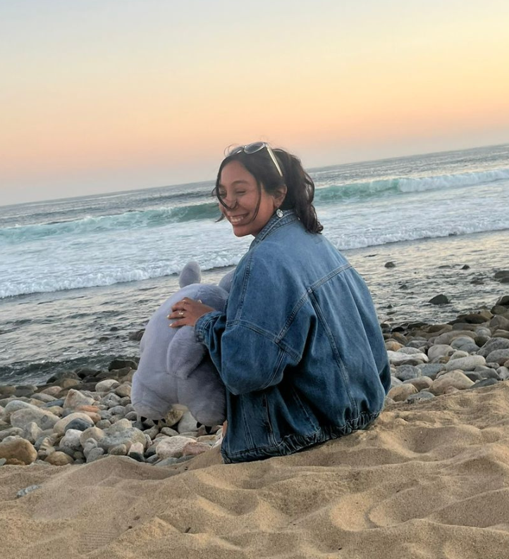
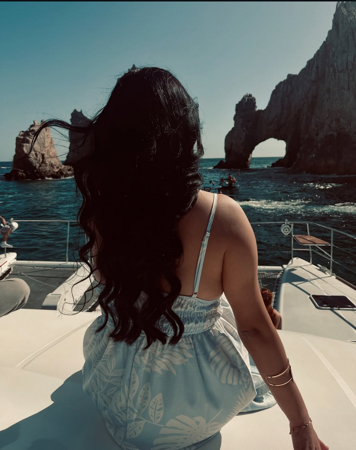
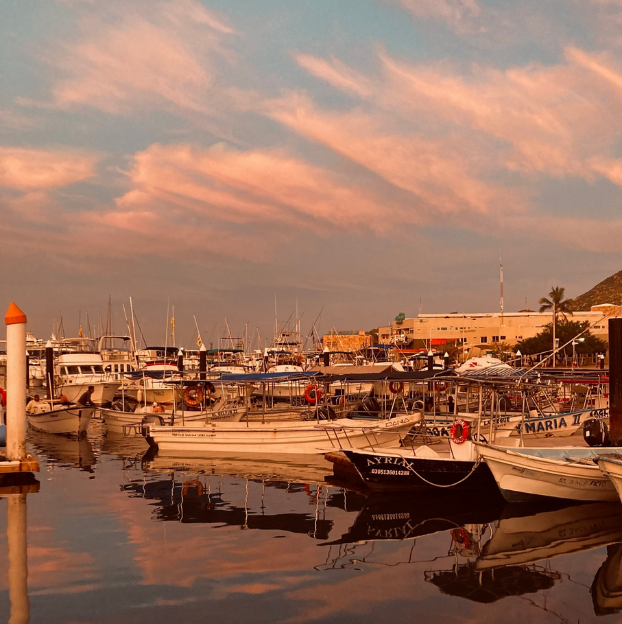
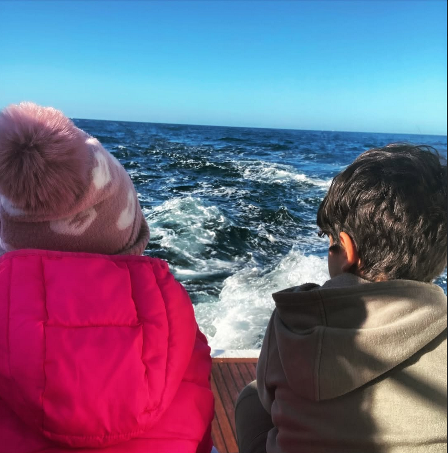
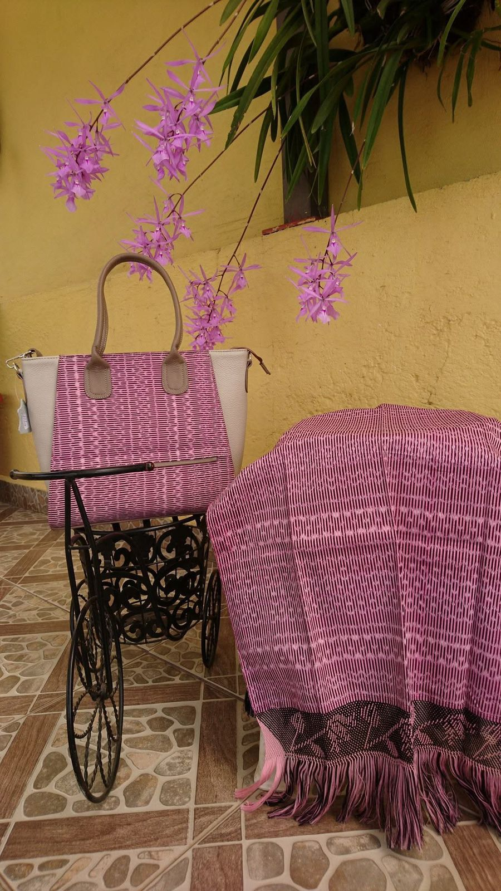
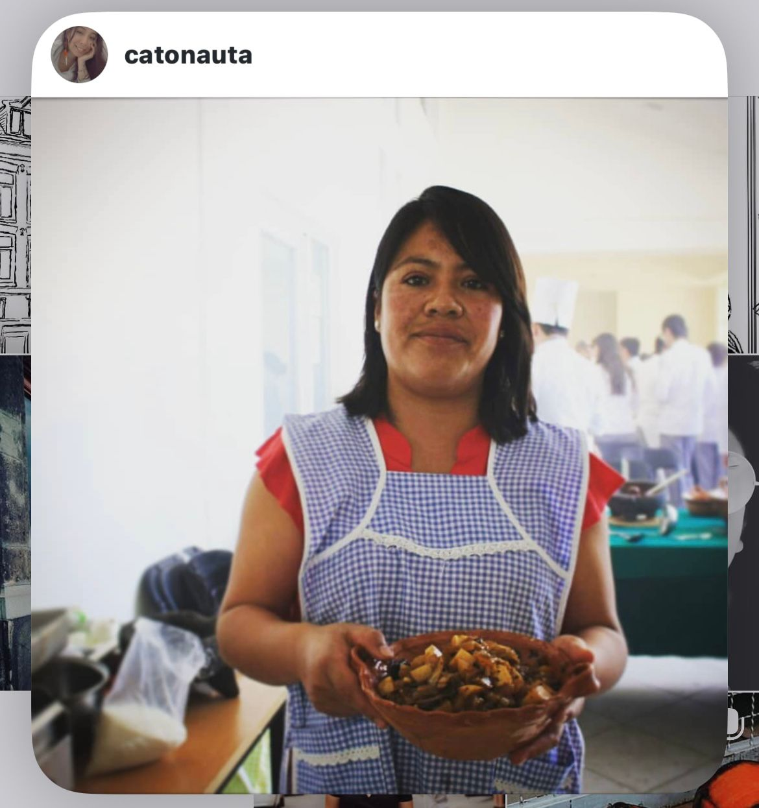
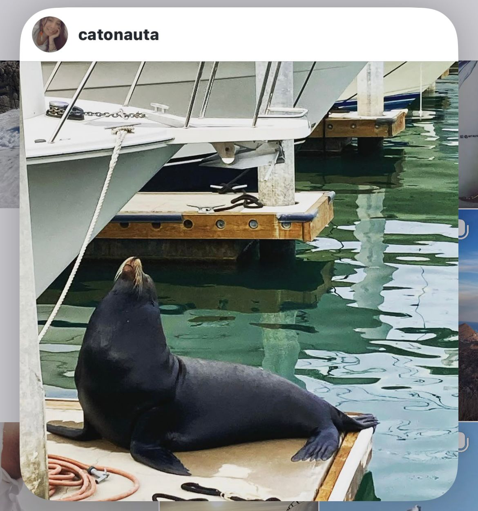

# Portafolio Creativo

¡Hola! Soy Ximena Jardón, nací en el Estado de México y soy licenciada en Turismo. Me apasionan la fotografía, la escritura, la comunicación visual y escrita, así como aprender cosas nuevas. Me considero una persona versátil, curiosa, inquieta y creativa.

## Habilidades

- Gestión de redes sociales
- Análisis de comunicación digital
- Programación y publicación de historias y reels
- Creación y gestión de campañas de contenido
- Redacción de storytelling

## Portafolio

### Arise Luxury Life Style

Arise fue un proyecto de largo plazo enfocado en crear contenido para redes sociales, dar mayor difusión a la marca y fortalecer la conexión con clientes recurrentes.

#### Mis aportaciones en Arise

- Creación de campañas publicitarias
- Desarrollo de códigos QR para reservas y acceso rápido al perfil de Instagram
- Diseño de menús
- Creación de campañas para interactuar con la comunidad de Arise

#### Galería de Arise

### Rebozo Tenancingo

Este fue un proyecto familiar orientado a llevar el rebozo a más lugares del país y del mundo, además de difundir su valor cultural. Gracias a la venta en redes sociales, el proyecto llegó incluso a una escuela textil en Japón que visita Tenancingo cada año para conocer el “Rebozo de bolita”.

#### Mis aportaciones en Rebozo

- Fotografía y video para la página de Facebook
- Gestión de redes sociales y comunidad
- Redacción de storytelling
- Diseño de logotipo

#### Galería de Rebozo

### Centro Universitario UAEM Tenancingo

En el CUT formé parte del equipo de Difusión Cultural, donde se organizaban eventos para que el alumnado desarrollara su creatividad y participara en actividades culturales.

#### Mis aportaciones en CUT

- Toma de fotografía y video para la difusión de actividades escolares y culturales
- Creación de campañas para difundir eventos
- Redacción de storytelling para guiones y recorridos de naturaleza

Además, tuve la oportunidad de impartir un taller de creación de personajes desde cero. En él trabajé con el alumnado la historia, el trasfondo y el diseño visual del personaje. El taller se llamó “Lectura creativa” porque también impulsaba otro tipo de lectura, como cómics y webtoons.

#### Galería de CUT

### Proyecto personal

Aquí comparto un vistazo de dos proyectos personales en los que sigo trabajando actualmente. Son fotografías que acompañan cuentos escritos por mí: “Pet cabito” y “Detalle pequeño con patas”. Este espacio refleja un poco más mi visión dentro de la comunicación visual.

#### Galería de proyectos personales

## Contacto

- [jardonximena975@gmail.com](mailto:jardonximena975@gmail.com)
- 722 368 4424
- Cabo San Lucas, BCS
